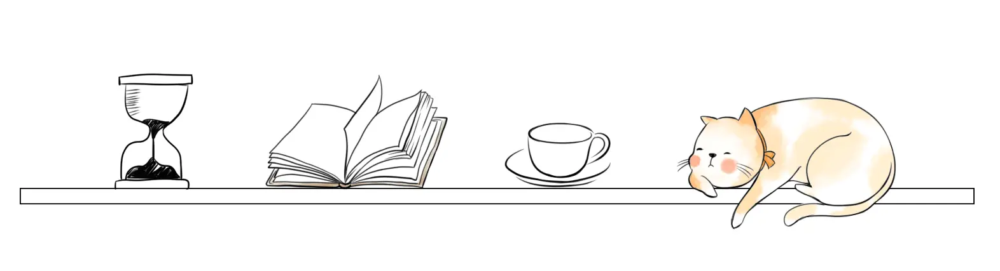

<h1>
  
  Hi there my No.
  
  visitor!
  
</h1>

### 🥅&nbsp; Annual Objectives
- 💻&nbsp;CS61A,CS61B,CS70;
- 🖥️&nbsp;Nand2Tetris,CS61C;

### ✨&nbsp; About Me
- 🔭 &nbsp;I’m an ungraduated student of Tongji University,China :wink:
- 🌱 &nbsp;I’m currently learning Berkeley CS61B Spring18 and CS70 fall 24
- ⚡ &nbsp;Welcome to communicate with me
- 💬 &nbsp;Wechat:wxid_bzwyjdujaj6922
- 👨‍💻 &nbsp;Email:tinuvile@outlook.com

### 🏠&nbsp; My Github

  
  

